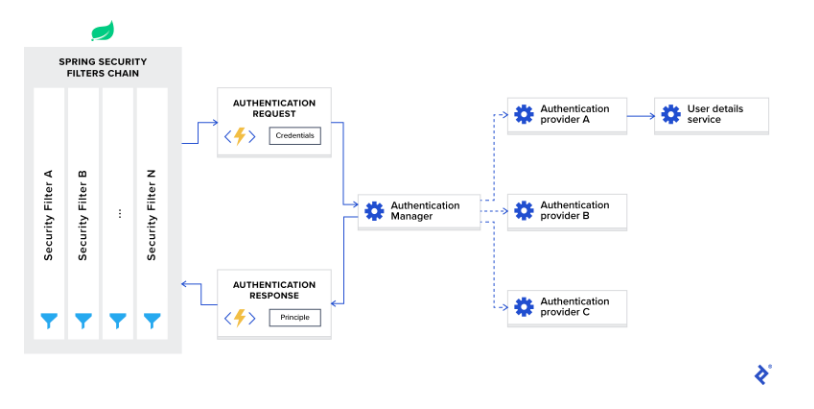
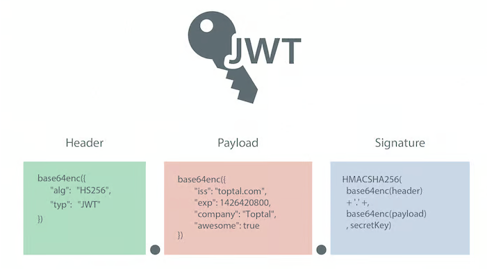

# Spring Authentication

- Authentication, kullanıcının sağladığı kimlik bilgilerini doğrulayarak kullanıcının kimliğini doğrulama sürecidir. Bir
  web sitesine giriş yaparken kullanıcı adı ve parola girmek gibi yaygın bir örnek verilebilir. Bunu, "Who are you?"
  sorusuna verilen bir yanıt olarak düşünebilirsiniz.

- Authorization, kullanıcının başarılı bir şekilde authenticate oldugu varsayımıyla belirli bir eylemi gerçekleştirmek
  veya belirli verileri okumak için uygun izne sahip olup olmadığını belirleme sürecidir. Bunu, "Bir kullanıcı bunu
  yapabilir/mi?" sorusuna verilen bir yanıt olarak düşünebilirsiniz.

- Principle, authenticated olan şu anki kullanıcıyı ifade eder. Bu terim, authentication işlemi başarılı olduğunda,
  kullanıcının temsil ettiği varlığı temsil etmek için kullanılır.

- Granted authority - Authenticated olan kullanıcının sahip olduğu permission'i ifade eder. Bir kullanıcının belirli
  eylemleri gerçekleştirmek veya belirli kaynaklara erişmek için yetkisi olabilir. Örneğin, bir kullanıcının "
  ROLE_ADMIN" veya "ROLE_USER" gibi rol veya yetkilendirme etiketlerine sahip olması, verilen yetkilere örnek olarak
  gösterilebilir.

Projeye spring security eklendiginde diger dependency'lerden farklı olarak anında tepki verir ve projenin tüm endpoint'
lerini korunaklı hale getirir. Proje ayağa kalktığında console da random bir şifre belirir. Herhangi bir endpoint'e
gitmeye çalıştığımız da otomatik olarak login page gelir. Default username olarak "user" password olarak da console da
bulunan generated password kullanılır

Uygulamayı her yeniden çalıştırdığımızda parolanın değiştiğini lütfen unutmayın. Bu davranışı değiştirmek ve şifreyi
statik yapmak istiyorsak application.properties dosyamıza aşağıdaki konfigürasyonu ekleyebiliriz:

```
spring.security.user.password=verysecretpass
```

Şimdi, giriş formuna kimlik bilgilerini girersek, URL'mize geri yönlendirilecek ve doğru sonucu göreceğiz. Lütfen
kullanıma hazır authentication işleminin session based olduğunu ve sessionu kapatmak istersek aşağıdaki URL'ye
erişebileceğimizi unutmayın: http://localhost:8080/logout

Bu out-of-the-box davranış, klasik MVC web uygulamaları için kullanışlı olabilir çünkü genellikle session-based
authentication'a sahiptir. Ancak single-page uygulamalarda genellikle kullanışlı değildir çünkü çoğu durumda
client-side-rendering ve JWT based stateless authentication'a sahibizdir. Bu durumda, Spring Security framework'u
yoğun bir şekilde özelleştirmemiz gerekecektir.

# Spring security architecture



## Security Filter Chain

Spring Security framework'ünü uygulamanıza eklediğinizde, otomatik olarak tüm gelen request'leri yakalayan bir filter
chain kaydedilir. Bu chain'de çeşitli filtreler bulunur ve her biri belirli bir kullanım durumunu işler.

Ornek olarak:

- Yapılandırmaya bağlı olarak, istenen URL'nin herkesin erişimine açık olup olmadığını kontrol edin.
- Session-based authentication durumunda, kullanıcının geçerli session'da zaten authenticated olup olmadığını kontrol
  edin.
- Kullanıcının istenen eylemi gerçekleştirmek için authorized olup olmadığını kontrol edin vb.

Bahsetmek istediğim önemli bir detay, Spring Security filtrelerinin lowest-order olarak kaydedildiği ve ilk çağrılan
filtreler olduğudur. Bazı kullanım durumlarında, özel filtrelerinizi onların önüne koymak isterseniz, filtrelerin
sıralamasına boşluk eklemeniz gerekecektir. Bunun için aşağıdaki yapılandırmayı kullanabilirsiniz:

```
spring.security.filter.order=10
```

Bu yapılandırmayı application.properties dosyamıza eklediğimizde, Spring Security filtrelerinin önünde 10 özel filtre
için yerimiz olacak.

## Authentication Manager

AuthenticationManager'ı bir koordinatör olarak düşünebilirsiniz. Birden fazla provider'i kaydedebilir ve isteğin türüne
bağlı olarak doğru provider'a bir authentication isteği iletecektir.

## Authentication Provider

AuthenticationProvider, specific types authentication işlemlerini işler. Interface yalnızca iki methodu expose eder;

- authenticate fonksiyonu, gelen request ile authentication işlemini gerçekleştirir.
- supports methodu, bu provider'in belirtilen authentication type'ini destekleyip desteklemediğini kontrol eder.

arayüzün önemli bir uygulaması DaoAuthenticationProvider'dır. Bu sağlayıcı, kullanıcı ayrıntılarını bir
UserDetailsService üzerinden alır.

DaoAuthenticationProvider, authentication işlemi sırasında principal'ları (kullanıcı adı, şifre, roller vb.)
sağlamak için bir UserDetailsService'e güvenir. UserDetailsService, genellikle veritabanı veya diğer veri kaynaklarından
kullanıcı ayrıntılarını getiren bir service veya component'dir.

## UserDetailsService

UserDetailsService, Spring dokümantasyonunda kullanıcıya özgü verileri yükleyen bir core interface olarak tanımlanır.
Çoğu kullanım durumunda, authentication provider'lar kullanıcı kimlik bilgilerini veritabanından çıkarır ve ardından
validation işlemini gerçekleştirir.

UserDetailsService, loadUserByUsername methodunu içeren bir interface'dir. Bu method, kullanıcı adına göre kullanıcının
ayrıntılarını yüklemek için kullanılır. Eğer kullanıcı bulunamazsa, UsernameNotFoundException istisnası fırlatılır.

## Authentication Using JWT with Spring Security

Spring Security'yi JWT kullanımı için özelleştirmek üzere, classpath'de @EnableWebSecurity anotasyonu eklenmiş bir
configuration sınıfına ihtiyacımız var.



## Header

token için data içerir ve en azından signature type'ını ve şifreleme algoritmasını içerir. JSON nesnesini
düzenlemek için bir JSON biçimlendirme aracı kullanabilirsiniz.

```
{
  "alg": "HS256",
  "typ": "JWT"
}
```

Yukarıdaki örnekte, "alg" alanı, JWT'nin nasıl imzalandığını belirtir ve "HS256" değeri, HMAC-SHA256 algoritmasını
kullandığını gösterir. "typ" alanı, JWT'nin türünü belirtir ve genellikle "JWT" değeri kullanılır.

## Claim

JWT context'inde claim, bir varlık hakkında (genellikle kullanıcı) statement ve token'in kendisi hakkında ek
metadata veriler olarak tanımlanabilir. Claim, iletmek istediğimiz bilgileri içerir ve sunucunun JSON Web Token kimlik
doğrulamasını düzgün bir şekilde işlemesi için kullanabileceği bilgileri içerir. Sağlanabilecek birden fazla Claim
bulunmaktadır; bunlar Registered Claim Names, Public Claim names ve Private Claim Names içerir.

### Registered JWT Claims

Bu JWT Claimleri zorunlu olmak yerine kullanışlı ve etkileşimli Claimler kümesi için bir başlangıç noktası sağlamak
amacıyla oluşturulmuştur.

Bazı claim isimleri:

- iss : Issuer, JSON Web Token (JWT) içindeki tokeni oluşturan tarafın kimliğini belirtir. Bu Claim, JWT'nin hangi
  sistemin veya uygulamanın tarafından oluşturulduğunu ifade eder
- sub : Subject, JSON Web Token (JWT) içindeki tokenin konusunu belirtir. Bu Claim, JWT'nin hangi varlık veya kimlik
  hakkında olduğunu ifade eder.
- aud : Audience, JSON Web Token (JWT) içindeki tokenin hedef kitle veya alıcısını belirtir
- exp : expiration time, JSON Web Token (JWT) içindeki tokenin geçerlilik süresinin sona erdiği zamanı belirtir. Bu
  Claim, JWT'nin ne zaman geçerli olduğunu ve ne zaman kullanılamayacağını ifade eder.
- nbf : Not Before, JSON Web Token (JWT) içindeki tokenin hangi tarihten önce geçerli olmadığını belirtir. Bu Claim,
  JWT'nin kullanılabilir hale gelme zamanını ifade eder.
- iat : (issued at) JSON Web Token (JWT) içindeki tokenin ne zaman oluşturulduğunu belirtir. Bu Claim, JWT'nin
  oluşturulma zamanını ifade eder.
- jti : JWT ID, JSON Web Token (JWT) içindeki tokenin ID'sini belirtir.

### Public Claims

Public Claimlerin çakışmayan isimlere sahip olması gerekmektedir. İsimleri URI veya URN olarak yapılandırılarak,
gönderen ve alıcıların kapalı bir ağın parçası olmadığı JWT'lerde isim çakışmaları önlenir.

Public Claim adının bir örneği şu şekilde olabilir: https://www.toptal.com/jwt_claims/is_admin. Best practice, bu
konumda claim'i açıklayan bir dosyanın bulunmasıdır, böylece belgelendirme için başvurulabilir.

### Private Claims

JWT'lerin yalnızca bilinen sistemler arasında kapalı bir ortamda (örneğin, bir kuruluş içinde) alışveriş edildiği
yerlerde kullanılabilir. Bu, kullanıcı kimlikleri, kullanıcı rolleri veya ID gibi, kendimiz tanımlayabileceğimiz
Claimleri içerir.

Kapalı veya özel bir sistem dışında çakışan anlamlara sahip olabilecek Claim adlarını kullanmak, çakışma riski taşır.
Bu nedenle, bu tür Claim adlarını dikkatli bir şekilde kullanmak önemlidir.

Bir web token'ın mümkün olduğunca küçük olmasını sağlamak önemlidir, bu nedenle public ve private Claimlerin içine
sadece gerekli verileri eklemek gerekir.

Ornek bir payload:

```
{
  "iss": "toptal.com",
  "exp": 1426420800,
  "https://www.toptal.com/jwt_claims/is_admin": true,
  "company": "Toptal",
  "awesome": true
}
```

iki register claim'i, bir public claim'i ve iki private claim içermektedir

## Signature

JWT standardı, final signed tokeni oluşturmak için JSON Web Signature (JWS) spesifikasyonunu takip eder. Bu, kodlanmış
JWT Header'i ve kodlanmış JWT Payload'unu birleştirerek ve HMAC SHA-256 gibi güçlü bir şifreleme algoritması
kullanılarak imzalar. İmzanın SECRET_KEY'i sunucu tarafından tutulur, böylece mevcut tokenları doğrulayabilir ve yeni
tokenları imzalayabilir. Bu işlem, tokenin bütünlüğünü ve doğruluğunu sağlamak için kullanılır. Sunucu, algoritmayı ve
SECRET_KEY'i kullanarak tokenin imzalanıp imzalanmadığını doğrular. Bu sayede tokenler güvenli bir şekilde taşınabilir
ve manipülasyon girişimlerine karşı korunabilir.

```
$encodedContent = base64UrlEncode(header) + "." + base64UrlEncode(payload);
$signature = hashHmacSHA256($encodedContent);
```

Bu bize JWT'nin final part'ini verir

```
yRQYnWzskCZUxPwaQupWkiUzKELZ49eM7oWxAQK_ZXw
```

## JWT Security and Encryption

JWT ile birlikte man-in-the-middle attack'larını önlemek için TLS/SSL kullanmak çok önemlidir. Çoğu durumda, bu, hassas
bilgiler içeren JWT veri paketini şifrelemek için yeterli olacaktır. Bununla birlikte, ek bir koruma katmanı eklemek
istiyorsak, JWT payload'unun kendisini JSON Web Encryption (JWE) spesifikasyonunu kullanarak şifreleyebiliriz. TLS/SSL
kullanımı, JWT'nin taşınırken şifrelenmesini ve güvenli bir şekilde iletilmesini sağlar. JWE kullanımı ise, JWT
payload'unun şifrelenerek yetkisiz erişime karşı korunmasını sağlar. Bu şekilde, JWT kullanırken hem taşıma güvenliği
hem de veri güvenliği sağlanmış olur.

Tabii ki, JWE kullanmanın ek yükünden kaçınmak istiyorsak, başka bir seçenek de hassas bilgileri veritabanında tutmak ve
hassas verilere erişmek gerektiğinde sunucuya ek API çağrıları için tokenimizi kullanmaktır. Bu yaklaşım, JWT'yi
yetkilendirme amacıyla kullanırken hassas verileri JWT içinde taşımak yerine sunucuya yönlendirme yapmayı tercih eder.
Token, kullanıcıyı doğrulamak ve yetkilendirmek için kullanılırken, hassas verilere erişim için sunucuya ek API
çağrıları yapılır. Bu şekilde, JWT'nin boyutu küçülür ve veri güvenliği sağlanırken, ek yükler ve işleme maliyetleri
azaltılabilir. Ancak, sunucuyla sürekli iletişim gerektiğinden performans ve ağ trafiği konusunda dikkatli olunmalıdır.
Ayrıca, veritabanındaki hassas bilgilere güvenli bir şekilde erişim sağlamak ve sunucuya yapılan istekleri doğru şekilde
doğrulamak ve yetkilendirmek için uygun önlemler alınmalıdır.

## Neden Web Token'lara ihtiyaç var?

JWT authentication'ın sağladığı tüm avantajları görmeden önce, geçmişte authentication'ın nasıl yapıldığına
bakmamız gerekiyor.

Geçmişte authentication genellikle session based bir yapı kullanılarak gerçekleştirilirdi. Kullanıcılar bir kimlik
doğrulama formu doldurarak kullanıcı adı ve parola gibi kimlik bilgilerini sunucuya gönderirdi. Sunucu, bu bilgileri
doğrulama işlemi için kullanır ve başarılı bir doğrulama durumunda bir session başlatır. Kullanıcıya session kimliği (
session ID) verilir ve bu session kimliği sunucu tarafında tutulur.

Bu session based authentication modeli, sunucunun sessionları yönetmesini ve session kimliklerini takip etmesini
gerektirir. Bu, sunucu tarafında ek kaynak ve işlem gücü gerektirir ve ölçeklenebilirlik sorunlarına yol açabilir.
Ayrıca, sunucu durumunu tuttuğu için yüksek erişilebilirlik gerektiren dağıtık sistemlerde zorluklar ortaya çıkabilir.

JWT yetkilendirması, bu geleneksel session based authentication modeline bir alternatif sunar. JWT'ler, istemci
tarafında tutulur ve sunucu tarafında session durumunu gerektirmez. Bu, sunucunun durumunu tutmaması ve
ölçeklenebilirlik sorunlarına daha iyi bir yanıt verebilmesi anlamına gelir. Ayrıca, JWT'lerin taşınabilirliği sayesinde
farklı uygulamalar ve hizmetler arasında kolayca paylaşılabilir ve kullanılabilir.

JWT yetkilendirmasının diğer avantajları arasında genişletilebilirlik, istemci tarafında depolama maliyetlerinin
azalması ve ölçeklenebilirliğin artması sayılabilir. Ancak, herhangi bir authentication yönteminde olduğu gibi, JWT
yetkilendirmesi de doğru şekilde uygulanmalı ve güvenlik önlemleri alınmalıdır.

### Server Based Authentication


HTTP protokolü stateless olduğu için, kullanıcı bilgilerini depolamak ve giriş yaptıktan sonra her bir sonraki
request'de kullanıcıyı doğrulamak için bir mekanizmaya ihtiyaç duyulur. Çoğu web sitesi, kullanıcının session kimliğini
depolamak için cookies'leri kullanır.

cookies'ler, sunucu tarafında oluşturulan ve kullanıcının tarayıcısına gönderilen küçük metin dosyalarıdır. session
kimliği gibi kullanıcı bilgilerini içerirler. Tarayıcı, her bir request'de bu cookies'leri sunucuya otomatik olarak
gönderir, böylece sunucu kullanıcıyı tanır ve session bilgilerini tutabilir.

cookies'ler, kullanıcının tarayıcısında saklandığından, kullanıcı her bir request'de otomatik olarak session
bilgilerini sunucuya göndermek zorunda kalmaz. Sunucu, cookies'leri kullanarak kullanıcının sessionunu tanır ve kimlik
doğrulama sürecini tekrarlamak zorunda kalmaz.

Bu şekilde, cookies'leri kullanıcı sessionlarının yönetiminde ve kimlik doğrulama sürecinde önemli bir rol oynar.
Kullanıcı giriş yaptığında sunucu tarafında session başlatılır ve kullanıcının session kimliği çerez olarak tarayıcıya
gönderilir. Sonraki isteklerde tarayıcı bu çerezi sunucuya gönderir ve sunucu kullanıcıyı tanır ve doğrular.

Tarayıcı, kullanıcının kimlik bilgisi ve parolasını içeren bir POST isteği yapar. Sunucu, kullanıcının tarayıcısına
ayarlanan bir cookie ile yanıt verir ve kullanıcıyı tanımlayan bir session id içerir. Her bir sonraki istekte sunucunun
o oturumu bulması ve deseralize etmesi gerekmektedir, çünkü kullanıcı verileri sunucuda depolanmaktadır.

### Sunucu Tabanlı Kimlik Doğrulamanın Dezavantajları

- Ölçeklenebilirlik sorunları: Sunucu, kullanıcı için bir oturum oluşturmalı ve bunu sunucunun bir yerinde kalıcı hale
  getirmelidir. Bu bellekte veya veritabanında yapılabilir. Dağıtık bir sistemimiz varsa, uygulama sunucusuna bağlı
  olmayan ayrı bir oturum depolama kullanmamız gerektiğinden emin olmamız gerekmektedir.
- (CORS): AJAX çağrılarıyla başka bir domain'den ("cross-origin") bir kaynağı almak istediğimizde, varsayılan
  olarak HTTP istekleri cross-origin isteklerinde cookies'leri içermediği için yasaklanmış isteklerle karşılaşabiliriz.
- Web framework'leri ile bağımlılık: Sunucu tabanlı kimlik doğrulama kullanırken, framework'un kimlik doğrulama şemasına
  bağlı kalırız. Farklı programlama dillerinde yazılmış farklı web framework'leri arasında oturum verilerini paylaşmak
  çok zor veya hatta imkansız olabilir.

### Token Based Authentication


Token tabanlı/JWT kimlik doğrulama stateless'dir, bu yüzden kullanıcı bilgilerini session'da saklamak gerekmez. Bu,
kullanıcının nerede oturum açtığıyla ilgilenmeden uygulamayı ölçeklendirebilme yeteneği sağlar. Aynı token'ı, giriş
yaptığımız domain dışında başka bir domain'den güvenli bir kaynağı almak için kolayca kullanabiliriz.

### Json Web Token nasıl çalışır?

Bir tarayıcı veya mobil istemci, kullanıcı giriş bilgilerini içeren bir request'i authentication server'a gönderir.
Authentication Server yeni bir JWT access token oluşturur ve bunu istemciye geri döner. Kısıtlı bir kaynağa yapılan her
request'de, istemci access token'ı query string'de veya Authorization header'inda gönderir. Sunucu daha sonra tokeni
doğrular ve geçerliyse güvenli kaynağı istemciye döndürür.

Authentication Server, herhangi bir güvenli imza methodunu kullanarak tokeni imzalayabilir. Örneğin, taraflar arasında
güvenli bir kanal olduğunda HMAC SHA-256 gibi symetric bir key algoritması kullanılabilir ve bu durumda SECRET_KEY
paylaşmak için ek bir adıma ihtiyaç duyulur. Alternatif olarak, RSA gibi asymetric, open key bir sistem de
kullanılabilir ve bu durumda daha fazla key paylaşımına ihtiyaç duyulmaz.

### Advantages of Token-Based Authentication

Stateless ve ölçeklendirilmesi daha kolay: Token, kullanıcıyı tanımlamak için gereken tüm bilgileri içerdiğinden,
session durumuna ihtiyaç duymaz. Bir load balancer kullanıyorsak, kullanıcıyı giriş yaptığımız aynı sunucuya bağlı
olmak yerine herhangi bir sunucuya iletebiliriz. Bu, uygulamamızın ölçeklenmesini kolaylaştırır ve daha esnek bir yapı
sunar.

Yeniden kullanılabilirlik: Aynı token'i kullanarak, farklı platformlarda ve alanlarda çalışan birçok ayrı sunucuya
sahip olabilir ve kullanıcıyı doğrulayabiliriz. İzinlerin başka bir uygulama ile paylaşıldığı bir uygulama geliştirmek
kolaydır. Bu, uygulamalar arasında verimli bir şekilde kimlik doğrulama ve yetkilendirme paylaşımı sağlar.

JWT Güvenliği: Cookie'ler kullanmadığımız için cross-site request forgery (CSRF) saldırılarına karşı korunmamız
gerekmez. Ancak, hassas bilgiler içeren token'larımızı JWE kullanarak şifrelememiz ve token'larımızı man-in-the-middle
saldırılarını önlemek için HTTPS üzerinden iletmemiz gerekmektedir. Bu sayede JWT güvenliğini artırabiliriz.

Performans: Her request'de session'i bulmak ve deserialize etmek için sunucu tarafında bir arama yapmamıza gerek yoktur.
Yapmamız gereken tek şey, token'i doğrulamak için HMAC SHA-256'yı hesaplamak ve içeriğini ayrıştırmaktır. Bu nedenle
JWT kullanımı performansı artırabilir.